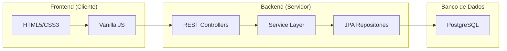

# MoneyNest AppFinance - Sistema de Gestão Financeira Pessoal

## Proposta do Projeto
O **MoneyNest** é uma aplicação de gestão financeira pessoal projetada para oferecer uma experiência intuitiva. O objetivo é permitir que os usuários monitorem seu saldo total, entradas (receitas) e saídas (despesas) de forma rápida, com uma interface inspirada nos principais aplicativos de fintech do mercado (como Nubank e Uber).

---

## Arquitetura do Sistema

A aplicação segue o padrão de **Arquitetura em Camadas** (N-Tier Architecture), separando claramente as responsabilidades entre o Backend (Servidor) e o Frontend (Cliente).

---

## Tecnologias Utilizadas

### Backend
*   **Java 25**: Linguagem principal (rodando em modo de compatibilidade Java 21).
*   **Spring Boot 3.2.4**: Framework para criação da API REST.
*   **Spring Data JPA**: Abstração para persistência de dados.
*   **PostgreSQL**: Banco de Dados relacional para armazenamento seguro.
*   **Lombok**: Automação de códigos repetitivos (Getters/Setters).

### Frontend
*   **Vanilla JavaScript (ES6+)**: Lógica sem frameworks pesados para máxima performance.
*   **CSS3 (Modern)**: Uso de Variáveis CSS, Flexbox, Grid, e Glassmorphism.
*   **FontAwesome 6**: Biblioteca de ícones profissionais.
*   **SweetAlert2**: Biblioteca para popups e notificações estilizadas.

---

## Estrutura e Funções do Código

### 1. Backend (Java)

#### **`TransactionController.java`**
Responsável por expor os endpoints da API para o Frontend.
*   `getAll()`: Retorna todas as transações cadastradas.
*   `getBalance()`: Calcula e retorna o saldo líquido atual.
*   `create()`: Recebe dados do frontend e cria uma nova transação.
*   `update()`: Atualiza uma transação existente com base no ID.
*   `delete()`: Remove permanentemente um registro.

#### **`TransactionService.java`**
Contém a **Lógica de Negócio**.
*   `validateAmount()`: Garante que valores negativos não sejam inseridos de forma errônea.
*   `parseType()`: Converte strings do frontend para o Enum do sistema.
*   Realiza a ponte entre o Controller e o Repositório, garantindo a integridade dos dados.

#### **`Transaction.java` (Model)**
Define como os dados são salvos no banco. Campos: `id`, `amount`, `description`, `date`, `type` (INCOME/EXPENSE), `bank`.

---

### 2. Frontend (Web)

#### **`app.js` (Lógica Principal)**
*   `fetchData()`: Busca dados do backend usando a `Fetch API`.
*   `renderTable()`: Constrói dinamicamente as linhas da tabela HTML com as transações.
*   `updateDashboard()`: Atualiza os cards de Saldo, Entradas e Saídas na tela.
*   `updateInsights()`: Calcula a porcentagem de economia baseada nas receitas.
*   `initTheme()`: Gerencia a alternância entre **Modo Claro** e **Modo Escuro**.

#### **`style.css` (Design)**
*   Implementa um sistema de temas baseado em **Variáveis CSS** (`--bg-color`, `--card-bg`).
*   Usa animações de gradiente no fundo para dar "vida" à aplicação.
*   Garante que o site seja **Responsivo** (adaptável a celulares).

---

## Conexão Backend x Frontend

A comunicação é feita via **JSON (JavaScript Object Notation)** através de chamadas HTTP:

1.  O Frontend faz uma requisição (ex: `fetch('/api/transactions')`).
2.  O Backend processa a lógica, consulta o banco e responde com um JSON.
3.  O Frontend recebe esse JSON, limpa a interface e renderiza os novos dados.

---

## Como Rodar a Aplicação

### Pré-requisitos
*   **Java 21 ou superior** instalado.
*   **PostgreSQL** instalado e rodando.
*   **IntelliJ IDEA** (ou sua IDE de preferência).

### Passo a Passo
1.  **Configurar o Banco de Dados**:
    *   Crie um banco de dados chamado `appfinance` no seu PostgreSQL.
    *   Acesse `src/main/resources/application.properties` e verifique se as credenciais (`username` e `password`) e a porta (`5434`) estão corretas.
2.  **Compilar o Projeto**:
    *   No IntelliJ, aguarde o Maven baixar as dependências.
    *   Execute o comando `mvn clean install` se estiver via terminal.
3.  **Iniciar a Aplicação**:
    *   Execute a classe `AppFinanceApplication.java`.
    *   O console deve mostrar: `Started AppFinanceApplication in ... seconds (JVM running on port 8081)`.
4.  **Acessar o Sistema**:
    *   Abra o navegador e acesse: **`http://localhost:8081`**

---

## Funções Avançadas Incluídas
*   **Busca em Tempo Real**: Filtre transações enquanto digita.
*   **Ocultar Saldo**: Privacidade com o ícone de "olho".
*   **Histórico Mensal**: Página dedicada para consultar meses específicos.
*   **Notificações SweetAlert**: Alertas profissionais para exclusão e salvamento.

---

**Desenvolvido com foco em Qualidade, Design e Performance.**
