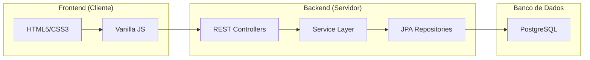

# MoneyNest AppFinance - Sistema de Gestão Financeira Pessoal

## Proposta do Projeto
O **MoneyNest** é uma aplicação de gestão financeira pessoal projetada para oferecer uma experiência intuitiva. O objetivo é permitir que os usuários monitorem seu saldo total, entradas (receitas) e saídas (despesas) de forma rápida, com uma interface inspirada nos principais aplicativos de fintech do mercado (como Nubank e Uber).

---

## Arquitetura do Sistema

A aplicação segue o padrão de **Arquitetura em Camadas** (N-Tier Architecture), separando claramente as responsabilidades entre o Backend (Servidor) e o Frontend (Cliente).



---

## Tecnologias Utilizadas

### Backend
*   **Java 25**: Linguagem principal (rodando em modo de compatibilidade Java 21).
*   **Spring Boot 3.2.4**: Framework para criação da API REST.
*   **Spring Data JPA**: Abstração para persistência de dados.
*   **PostgreSQL**: Banco de Dados relacional para armazenamento seguro.
*   **Lombok**: Automação de códigos repetitivos (Getters/Setters).

### Frontend
*   **Vanilla JavaScript (ES6+)**: Lógica sem frameworks pesados para máxima performance.
*   **CSS3 (Modern)**: Uso de Variáveis CSS, Flexbox, Grid, e Glassmorphism.
*   **FontAwesome 6**: Biblioteca de ícones profissionais.
*   **SweetAlert2**: Biblioteca para popups e notificações estilizadas.

---

## Estrutura e Funções do Código

### 1. Backend (Java)

#### **`TransactionController.java`**
Responsável por expor os endpoints da API para o Frontend.
*   `getAll()`: Retorna todas as transações cadastradas.
*   `getBalance()`: Calcula e retorna o saldo líquido atual.
*   `create()`: Recebe dados do frontend e cria uma nova transação.
*   `update()`: Atualiza uma transação existente com base no ID.
*   `delete()`: Remove permanentemente um registro.

#### **`TransactionService.java`**
Contém a **Lógica de Negócio**.
*   `validateAmount()`: Garante que valores negativos não sejam inseridos de forma errônea.
*   `parseType()`: Converte strings do frontend para o Enum do sistema.
*   Realiza a ponte entre o Controller e o Repositório, garantindo a integridade dos dados.

#### **`Transaction.java` (Model)**
Define como os dados são salvos no banco. Campos: `id`, `amount`, `description`, `date`, `type` (INCOME/EXPENSE), `bank`.

---

### 2. Frontend (Web)

#### **`app.js` (Lógica Principal)**
*   `fetchData()`: Busca dados do backend usando a `Fetch API`.
*   `renderTable()`: Constrói dinamicamente as linhas da tabela HTML com as transações.
*   `updateDashboard()`: Atualiza os cards de Saldo, Entradas e Saídas na tela.
*   `updateInsights()`: Calcula a porcentagem de economia baseada nas receitas.
*   `initTheme()`: Gerencia a alternância entre **Modo Claro** e **Modo Escuro**.

#### **`style.css` (Design)**
*   Implementa um sistema de temas baseado em **Variáveis CSS** (`--bg-color`, `--card-bg`).
*   Usa animações de gradiente no fundo para dar "vida" à aplicação.
*   Garante que o site seja **Responsivo** (adaptável a celulares).

---

## Conexão Backend x Frontend

A comunicação é feita via **JSON (JavaScript Object Notation)** através de chamadas HTTP:

1.  O Frontend faz uma requisição (ex: `fetch('/api/transactions')`).
2.  O Backend processa a lógica, consulta o banco e responde com um JSON.
3.  O Frontend recebe esse JSON, limpa a interface e renderiza os novos dados.

---

# Guia de Configuração do Projeto

## Pré-requisitos

Antes de executar a aplicação, certifique-se de que os seguintes requisitos estão instalados e configurados:

- Java Development Kit (JDK)
- Apache Maven
- Banco de dados PostgreSQL

Certifique-se de que o PostgreSQL está em execução e que o banco de dados necessário já foi criado.

---

# Configuração da Aplicação

## 1. Configurar o Banco de Dados PostgreSQL

Configure a conexão com o banco PostgreSQL no arquivo:

```text
src/main/resources/application.properties
```

Atualize as propriedades do banco de acordo com o seu ambiente local.

Exemplo:

```properties
spring.datasource.url=jdbc:postgresql://localhost:5432/seu_banco
spring.datasource.username=seu_usuario
spring.datasource.password=sua_senha

spring.jpa.hibernate.ddl-auto=update
spring.jpa.show-sql=true
```

Substitua:

- `seu_banco` pelo nome do seu banco PostgreSQL.
- `seu_usuario` pelo usuário do PostgreSQL.
- `sua_senha` pela senha do PostgreSQL.

---

## 2. Configurar as Variáveis de Ambiente

O projeto utiliza variáveis de ambiente para armazenar informações sensíveis.

Primeiro, utilize o arquivo de exemplo como referência:

```bash
.env.example
```

Crie um novo arquivo `.env` na raiz do projeto:

```bash
touch .env
```

Copie as variáveis necessárias do arquivo `.env.example` para o arquivo `.env` e atualize os valores de acordo com o seu ambiente.

Exemplo:

```env
JWT_SECRET=sua_chave_secreta_gerada
```

> Nunca envie o arquivo `.env` para o controle de versão.

Certifique-se de que o arquivo `.env` está incluído no `.gitignore`:

```gitignore
.env
```

---

## 3. Gerar a Chave Secreta JWT

A aplicação utiliza uma chave secreta JWT para autenticação e geração de tokens.

Gere uma chave segura utilizando o comando:

```bash
openssl rand -base64 64
```

Exemplo de saída:

```text
a8Jk92kLmX7sQ2pW9fL0zYx3vR8mN4cB6dE1sT5uP9qW7xZ2
```

Copie o valor gerado e adicione ao arquivo `.env`:

```env
JWT_SECRET=a8Jk92kLmX7sQ2pW9fL0zYx3vR8mN4cB6dE1sT5uP9qW7xZ2
```

---

# Executando a Aplicação

## 4. Iniciar a Aplicação

Execute a aplicação utilizando Maven:

```bash
mvn spring-boot:run
```

Aguarde até que a aplicação seja inicializada corretamente.

Exemplo de saída esperada:

```text
Started Application in X seconds
```

---

# Acessando a Aplicação

## 5. Abrir no Navegador

Após a aplicação iniciar, abra o navegador e acesse:

```text
http://localhost:8081
```

A aplicação estará disponível localmente.

---

# Solução de Problemas

## Problemas de Conexão com PostgreSQL

Verifique se o PostgreSQL está em execução:

```bash
sudo systemctl status postgresql
```

Verifique os clusters ativos do PostgreSQL:

```bash
pg_lsclusters
```

Saída esperada:

```text
Ver Cluster Port Status Owner
17  main    5432 online postgres
```

Teste a conexão com o PostgreSQL:

```bash
psql -h localhost -p 5432 -U seu_usuario -d seu_banco
```

---

## Porta Já Está em Uso

Verifique qual processo está utilizando a porta `8081`:

```bash
ss -ltnp | grep 8081
```

Finalize o processo conflitante ou altere a porta da aplicação.

---

# Fluxo de Desenvolvimento

1. Clone o repositório.
2. Configure o PostgreSQL.
3. Crie o arquivo `.env`.
4. Gere a chave secreta JWT.
5. Configure o arquivo `application.properties`.
6. Inicie a aplicação com Maven.
7. Acesse a aplicação pelo navegador.


---

## Funções Avançadas Incluídas
*   **Busca em Tempo Real**: Filtre transações enquanto digita.
*   **Ocultar Saldo**: Privacidade com o ícone de "olho".
*   **Histórico Mensal**: Página dedicada para consultar meses específicos.
*   **Notificações SweetAlert**: Alertas profissionais para exclusão e salvamento.

---

**Desenvolvido com foco em Qualidade, Design e Performance.**
