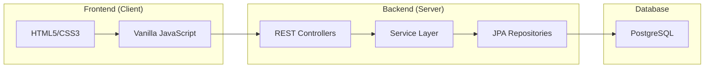

# MoneyNest AppFinance – Personal Finance Management System

## Project Overview

**MoneyNest** is a personal finance management application designed to provide an intuitive and modern user experience. It allows users to track their total balance, income, and expenses through a clean interface inspired by popular fintech applications.

---

# System Architecture

The application follows a **Layered Architecture (N-Tier Architecture)**, clearly separating responsibilities between the frontend and backend.



---

# Technologies

## Backend

- **Java 25** (running in Java 21 compatibility mode)
- **Spring Boot 3.2.4**
- **Spring Data JPA**
- **PostgreSQL**
- **Lombok**

## Frontend

- **Vanilla JavaScript (ES6+)**
- **Modern CSS3**
- **Font Awesome 6**
- **SweetAlert2**

---

# Project Structure

## Backend

### `TransactionController.java`

Responsible for exposing the REST API endpoints.

**Main methods**

- `getAll()` – Returns all transactions.
- `getBalance()` – Returns the current balance.
- `create()` – Creates a new transaction.
- `update()` – Updates an existing transaction.
- `delete()` – Deletes a transaction permanently.

---

### `TransactionService.java`

Contains the application's **business logic**.

**Responsibilities**

- `validateAmount()` – Validates transaction amounts.
- `parseType()` – Converts frontend values into the application's transaction enum.
- Connects controllers and repositories while ensuring data consistency.

---

### `Transaction.java`

Represents the transaction entity stored in the database.

**Fields**

- `id`
- `amount`
- `description`
- `date`
- `type` (`INCOME` / `EXPENSE`)
- `bank`

---

## Frontend

### `app.js`

Main application logic.

**Main functions**

- `fetchData()` – Fetches transactions from the backend.
- `renderTable()` – Renders the transaction table dynamically.
- `updateDashboard()` – Updates balance, income, and expense cards.
- `updateInsights()` – Calculates savings percentage.
- `initTheme()` – Manages Light and Dark mode.

---

### `style.css`

Responsible for the application's UI.

Features include:

- CSS Variables for theming
- Glassmorphism design
- Animated gradient background
- Responsive layout for desktop and mobile devices

---

# Backend–Frontend Communication

The application uses **REST APIs** with **JSON** for communication.

1. The frontend sends an HTTP request.
2. The backend processes the request and queries the database.
3. A JSON response is returned.
4. The frontend updates the interface with the latest data.

---

# Getting Started

## Prerequisites

- Java 21 or later
- PostgreSQL
- Maven
- IntelliJ IDEA (or another Java IDE)

---

## Installation

### 1. Configure the Database

Create a PostgreSQL database named:

```text
appfinance
```

Edit the following file:

```text
src/main/resources/application.properties
```

Update:

- Database username
- Database password
- Database port (default: `5434`)

---

### 2. Build the Project

```bash
mvn clean install
```

---

### 3. Run the Application

Run:

```text
AppFinanceApplication.java
```

The application will start on:

```text
http://localhost:8081
```

---

# Features

- Income and expense management
- Financial dashboard
- Real-time transaction search
- Hide/show balance
- Monthly transaction history
- Light & Dark mode
- Responsive design
- SweetAlert2 notifications

---

# Project Goals

This project was built with a focus on:

- Clean Architecture
- Code Quality
- Performance
- User Experience (UX)
- Modern UI Design
- Maintainability

---

## License

This project is available for educational purposes.
