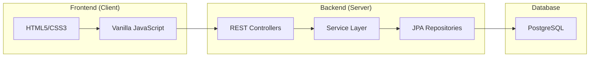

# MoneyNest AppFinance – Personal Finance Management System

## Project Overview

**MoneyNest** is a personal finance management application designed to provide an intuitive and modern user experience. It allows users to track their total balance, income, and expenses through a clean interface inspired by popular fintech applications.

---

# System Architecture

The application follows a **Layered Architecture (N-Tier Architecture)**, clearly separating responsibilities between the frontend and backend.



---

# Technologies

## Backend

- **Java 25** (running in Java 21 compatibility mode)
- **Spring Boot 3.2.4**
- **Spring Data JPA**
- **PostgreSQL**
- **Lombok**

## Frontend

- **Vanilla JavaScript (ES6+)**
- **Modern CSS3**
- **Font Awesome 6**
- **SweetAlert2**

---

# Project Structure

## Backend

### `TransactionController.java`

Responsible for exposing the REST API endpoints.

**Main methods**

- `getAll()` – Returns all transactions.
- `getBalance()` – Returns the current balance.
- `create()` – Creates a new transaction.
- `update()` – Updates an existing transaction.
- `delete()` – Deletes a transaction permanently.

---

### `TransactionService.java`

Contains the application's **business logic**.

**Responsibilities**

- `validateAmount()` – Validates transaction amounts.
- `parseType()` – Converts frontend values into the application's transaction enum.
- Connects controllers and repositories while ensuring data consistency.

---

### `Transaction.java`

Represents the transaction entity stored in the database.

**Fields**

- `id`
- `amount`
- `description`
- `date`
- `type` (`INCOME` / `EXPENSE`)
- `bank`

---

## Frontend

### `app.js`

Main application logic.

**Main functions**

- `fetchData()` – Fetches transactions from the backend.
- `renderTable()` – Renders the transaction table dynamically.
- `updateDashboard()` – Updates balance, income, and expense cards.
- `updateInsights()` – Calculates savings percentage.
- `initTheme()` – Manages Light and Dark mode.

---

### `style.css`

Responsible for the application's UI.

Features include:

- CSS Variables for theming
- Glassmorphism design
- Animated gradient background
- Responsive layout for desktop and mobile devices

---

# Backend–Frontend Communication

The application uses **REST APIs** with **JSON** for communication.

1. The frontend sends an HTTP request.
2. The backend processes the request and queries the database.
3. A JSON response is returned.
4. The frontend updates the interface with the latest data.

---

# Project Setup Guide

## Prerequisites

Before running the application, make sure you have the following installed and configured:

- Java Development Kit (JDK)
- Apache Maven
- PostgreSQL Database

Ensure that PostgreSQL is running and that the required database has been created.

---

# Application Configuration

## 1. Configure PostgreSQL Database

Configure your PostgreSQL database connection in:

```text
src/main/resources/application.properties
```

Update the database properties according to your local environment.

Example:

```properties
spring.datasource.url=jdbc:postgresql://localhost:5432/your_database
spring.datasource.username=your_username
spring.datasource.password=your_password

spring.jpa.hibernate.ddl-auto=update
spring.jpa.show-sql=true
```

Replace:

- `your_database` with your PostgreSQL database name.
- `your_username` with your PostgreSQL username.
- `your_password` with your PostgreSQL password.

---

## 2. Configure Environment Variables

The project uses environment variables to store sensitive information.

First, use the example file as a reference:

```bash
.env.example
```

Create a new `.env` file in the project root directory:

```bash
touch .env
```

Copy the required variables from `.env.example` into `.env` and update the values according to your environment.

Example:

```env
JWT_SECRET=your_generated_secret_key
```

> Do not commit the `.env` file to version control.

Make sure `.env` is included in `.gitignore`:

```gitignore
.env
```

---

## 3. Generate JWT Secret Key

The application requires a secure JWT secret key for token authentication.

Generate a valid secret key using:

```bash
openssl rand -base64 64
```

Example output:

```text
a8Jk92kLmX7sQ2pW9fL0zYx3vR8mN4cB6dE1sT5uP9qW7xZ2
```

Add the generated value to your `.env` file:

```env
JWT_SECRET=a8Jk92kLmX7sQ2pW9fL0zYx3vR8mN4cB6dE1sT5uP9qW7xZ2
```

---

# Running the Application

## 4. Start the Application

Run the application using Maven:

```bash
mvn spring-boot:run
```

Wait until the application finishes starting successfully.

Example output:

```text
Started Application in X seconds
```

---

# Accessing the Application

## 5. Open in Browser

After the application starts, open your browser and access:

```text
http://localhost:8081
```

The application should now be available locally.

---

# Troubleshooting

## PostgreSQL Connection Issues

Check if PostgreSQL is running:

```bash
sudo systemctl status postgresql
```

Check active PostgreSQL clusters:

```bash
pg_lsclusters
```

Expected output:

```text
Ver Cluster Port Status Owner
17  main    5432 online postgres
```

Test PostgreSQL connection:

```bash
psql -h localhost -p 5432 -U your_username -d your_database
```

---

## Port Already in Use

Check which process is using port `8081`:

```bash
ss -ltnp | grep 8081
```

Stop the conflicting process or configure another application port.

---

# Development Workflow

1. Clone the repository.
2. Configure PostgreSQL.
3. Create the `.env` file.
4. Generate the JWT secret.
5. Configure application properties.
6. Start the application with Maven.
7. Access the application through the browser.


---

# Features

- Income and expense management
- Financial dashboard
- Real-time transaction search
- Hide/show balance
- Monthly transaction history
- Light & Dark mode
- Responsive design
- SweetAlert2 notifications

---

# Project Goals

This project was built with a focus on:

- Clean Architecture
- Code Quality
- Performance
- User Experience (UX)
- Modern UI Design
- Maintainability

---

## License

This project is available for educational purposes.
